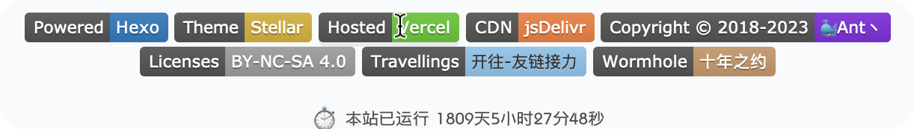

---
# 基本信息
title: Blog 更新日志暨Hello World
date: 2024/05/08/00/07
tags: [Blog]
categories: [Blog]
description: 用于记录此博客的更新日志；同时，程序员不可越少的一集：问候世界
# 封面
cover: 
banner: 
poster: # 海报（可选，全图封面卡片）
  topic: 标题上方的小字 # 可选
  headline: 大标题 # 必选
  caption: 标题下方的小字 # 可选
  color: 标题颜色 # 可选
# 插件
sticky: # 数字越大越靠前
mermaid:
katex: 
mathjax: 
# 可选
topic: Blog # 专栏 id
author: Monty Lee
references:
comments: # 设置 false 禁止评论
indexing: # 设置 false 避免被搜索
breadcrumb: # 设置 false 隐藏面包屑导航
leftbar: 
rightbar:
h1: # 设置为 '' 隐藏标题
type: story # tech/story
---



偶然之下看到 [cayzlh](https://www.cayzlh.com) 的博客，非常简洁，脑子一热决定跟个风，经过一个晚上的折腾，终于成功部署。

1. 本站由 [Monty Lee](https://www.montylee.cn) 基于 [Hexo](https://hexo.io/zh-cn/) 框架下的 [Stellar](https://github.com/xaoxuu/hexo-theme-stellar/tree/1.28.1) 主题创建
2. 使用 [GitHub](https://github.com) 托管代码，[Vercel](https://vercel.com) 实现无服务器部署



- [ ] **图床**

  - [x] ~~暂时使用 [imgtp](https://imgtp.com) 这个在线的免费图床~~

  - [ ] 不过觉得安全性不高，后续考虑使用 GitHub 作为图床，本地使用 PigGo 上传，jsDelivr 实现 CDN 加速，参加 [如何使用jsDelivr+Github 实现免费CDN加速?](https://zhuanlan.zhihu.com/p/346643522)

- [ ] **footer 部分的倒计时功能**

  - [x] ~~初步实现功能~~

  - [ ] 美化，参见 [cayzlh](https://www.cayzlh.com)  

    

- [ ] **友链和关于页面**

- [ ] **右侧栏公告及索引**

  

- [ ] **RSS 订阅**

- [ ]  [小组件配置](https://xaoxuu.com/wiki/stellar/widgets/)

---

  - [如何使用jsDelivr+Github 实现免费CDN加速?](https://zhuanlan.zhihu.com/p/346643522)
  - [如何利用 Github 搭建自己的免费图床？](https://zhuanlan.zhihu.com/p/353775844)
  - [Stellar - 每个人的独立博客](https://xaoxuu.com/wiki/stellar/#start)
  - ...

---
