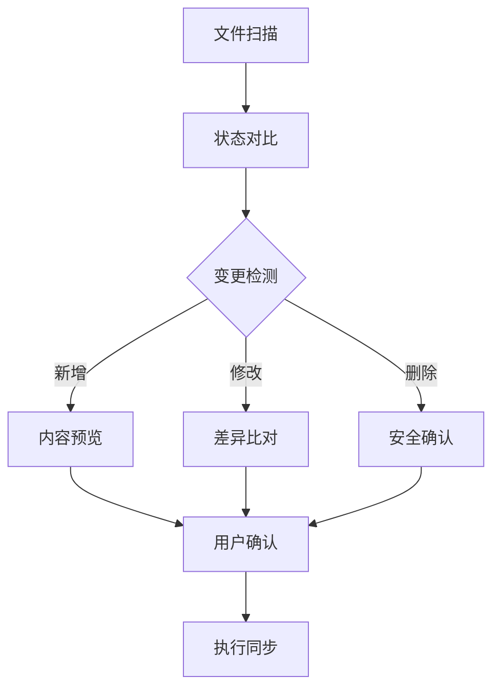

# 引言

为什么要写这么一个脚本呢？实际上是我这几天一直在找一个多端同步我的博客笔记的办法。我说使用的博客方案是是：Hexo + stellar 主题，写文章主要是依靠 obsidian。具体的工具是 Mac 和 iPhone。

至于我为什么需要手机端，主要还是平时话多，想随手记下来。

因此，想要实现多端同步，主要是解决下面几个问题：
1. 如何实现 Mac 端的 Obsidian 与手机端同步
2. 在解决第一个问题的过程中，引出了第二个问题：如何实现 Obsidian 不同仓库间的同步

简单说一下我的解决思路：

实现 Mac 与 iPhone 之间的同步很简单，只要借助 Icloud 这个媒介就可以了。但是同步哪一个仓库呢？同步 Hexo 主题下的 `_posts` 仓库吗？如果可以直接把这个同步过去，也就不会有这篇文章的需求了。在 Obsidian 的手机端中，它不支持手动选择仓库。如下图所示，只能够根据它指定的路径进行创建仓库。因此，我没办法直接把 `_post` 目录同步到手机中。


我需要一个能够在我的 Mac 和手机之间同步的仓库，并且这个仓库还要和我的 `_post` 同步，便于我发文章。所以问题就变成了，我如何双向同步两个仓库，或者说是文件夹。

我想到了 `git` ，或许我可以借助它的思路来解决这个问题。


# 设计实现



关键的步骤在于：
1. 变更检测：通过维护.sync_state文件记录上次同步状态，并与当前文件系统状态对比来检测文件的新增、修改和删除。
2. 差异对比：使用difflib.unified_diff()函数对文件内容进行逐行比较，生成详细的差异报告，包括具体的修改内容和位置。
3. 冲突解决：采用"最新胜出"的策略，通过比较文件的最后修改时间（os.path.getmtime()），自动选择保留较新的版本。

做好上面三步后，实际的修改反而不是很难。

## 1. 变更检测机制

变更检测是整个同步过程的第一步，也是最关键的环节之一。该工具通过以下方式实现变更检测：

### 1.1 状态记录
```python
def load_last_state(state_file):
    """加载上次同步状态"""
    if os.path.exists(state_file):
        with open(state_file, 'r') as f:
            return set(json.load(f))
    return set()
```

`.sync_state` 文件是一个用于记录文件夹同步状态的JSON格式文件，它在同步过程中扮演"记忆者"的角色。

每个同步文件夹都会有自己的.sync_state文件：

```python
state_file_a = os.path.join(folder_a, '.sync_state')
state_file_b = os.path.join(folder_b, '.sync_state')
```


工具使用`.sync_state`文件记录每次同步后的文件状态，这使得我们能够：追踪文件的添加和删除、识别两个文件夹之间的差异和维护同步历史。

### 1.2 文件遍历
```python
def get_relative_paths(folder, ignore_patterns):
    """获取文件夹中所有文件的相对路径"""
    relative_paths = set()
    for root, dirs, files in os.walk(folder):
        dirs[:] = [d for d in dirs if not should_ignore(d, ignore_patterns)]
        for file in files:
            if not should_ignore(file, ignore_patterns):
                rel_path = os.path.relpath(os.path.join(root, file), folder)
                relative_paths.add(rel_path)
    return relative_paths
```

变更检测过程会：递归遍历目录结构，过滤忽略的文件和目录，然后生成相对路径集合。

## 2. 差异对比实现

差异对比环节主要关注两个方面：文件内容的差异和时间戳的比较。

### 2.1 内容差异比较
```python
def get_file_diff(file1, file2, folder_a, folder_b):
    """获取两个文件的差异"""
    try:
        with open(file1, 'r', encoding='utf-8') as f1, open(file2, 'r', encoding='utf-8') as f2:
            diff = difflib.unified_diff(
                f1.readlines(),
                f2.readlines(),
                fromfile=f"文件夹A ({folder_a}): {os.path.basename(file1)}",
                tofile=f"文件夹B ({folder_b}): {os.path.basename(file2)}",
                n=3
            )
            return ''.join(diff)
    except Exception as e:
        return f"无法比较文件: {str(e)}"
```

 使用`difflib`库进行文本比较，生成统一格式的差异报告，显示上下文信息。

### 2.2 变更摘要生成
```python
def get_changes_summary(folder_a, folder_b, last_state_a, last_state_b, files_in_a, files_in_b):
    """获取变更摘要"""
    changes = {
        'new_in_a': [],
        'new_in_b': [],
        'modified': [],
        'deleted_from_a': [],
        'deleted_from_b': []
    }
```

变更摘要包含：新增文件的识别、修改文件的检测和删除文件的记录。这一步主要是为了后面用户手动确认修改哪些信息作准备的。

## 3. 冲突解决策略

冲突解决是确保数据一致性的关键环节，这一部分其实并不完善，由于我是一个人写博客，一般也不会遇到同时在两个仓库对同一个地方进行修改导致冲突。但是还收就要写了一下，提供了一下两种解决思路：根据时间戳自动解决与用户手动判断解决。

### 3.1 时间戳比较
```python
if rel_path in files_in_a and rel_path in files_in_b:
    time_a = os.path.getmtime(file_in_a)
    time_b = os.path.getmtime(file_in_b)
    
    if time_a > time_b:
        shutil.copy2(file_in_a, file_in_b)
        print(f"更新文件 (B): {rel_path}")
    elif time_b > time_a:
        shutil.copy2(file_in_b, file_in_a)
        print(f"更新文件 (A): {rel_path}")
```

- 系统首先比较两个文件的最后修改时间
	- 如果文件夹A中的文件更新，则将A中的文件复制到B
	- 如果文件夹B中的文件更新，则将B中的文件复制到A
- 这种方式基于"最新版本优先"的原则

### 3.2 用户交互
```python
while True:
    print("\n请选择操作：")
    print("1. 查看特定文件的完整内容")
    print("2. 继续同步")
    print("3. 取消同步")
```

交互式解决方案：
- 提供文件内容预览
- 允许用户查看详细差异
- 支持手动决策同步操作


# 测试

```shell
~/F/Hexo main !1 ?4 ❯ /opt/homebrew/bin/python3 /Users/montylee/Forsertee/Hexo/sync_folder.py

开始同步 - 2025-04-17 01:16:15
源文件夹 A: /Users/montylee/Library/Mobile Documents/iCloud~md~obsidian/Documents/Forsertee
源文件夹 B: /Users/montylee/Forsertee/Hexo/source/_posts

=== 同步变更摘要 ===

文件夹 A: /Users/montylee/Library/Mobile Documents/iCloud~md~obsidian/Documents/Forsertee
文件夹 B: /Users/montylee/Forsertee/Hexo/source/_posts

将从文件夹 A 同步到 B 的新文件:

将从文件夹 B 同步到 A 的新文件:

需要更新的文件:

将从文件夹 A 中删除的文件:
  - [文件夹A] sysc_folder：实现文件夹信息同步.md

将从文件夹 B 中删除的文件:

请选择操作：
1. 查看特定文件的完整内容
2. 继续同步
3. 取消同步
请输入选项 (1/2/3): 2

开始执行同步...

同步完成:
- 同步文件数: 0
- 删除文件数: 0
- 忽略文件数: 0
结束时间: 2025-04-17 01:16:24
```

1. 新文件同步：
	- A → B：sysc_folder：实现文件夹信息同步.md（从Obsidian同步到Hexo）
	- B → A：sync_folder.py：双向文件夹同步工具.md（从Hexo同步到Obsidian）

2. 删除的文件：
	- 文件夹B中删除：sysc_folder：实现文件夹信息同步.md


# 完整代码



```python
import os
import shutil
import json
from datetime import datetime
import difflib
import filecmp

def get_relative_paths(folder, ignore_patterns):
    """获取文件夹中所有文件的相对路径"""
    relative_paths = set()
    for root, dirs, files in os.walk(folder):
        # 过滤需要忽略的目录
        dirs[:] = [d for d in dirs if not should_ignore(d, ignore_patterns)]
        
        for file in files:
            if not should_ignore(file, ignore_patterns):
                # 获取相对路径
                rel_path = os.path.relpath(os.path.join(root, file), folder)
                relative_paths.add(rel_path)
    return relative_paths

def should_ignore(path, ignore_patterns):
    """检查文件或目录是否应该被忽略"""
    name = os.path.basename(path)
    # 检查是否匹配任何忽略模式
    for pattern in ignore_patterns:
        # 简单的通配符匹配
        if pattern.startswith('*') and name.endswith(pattern[1:]):
            return True
        elif pattern.endswith('*') and name.startswith(pattern[:-1]):
            return True
        elif pattern == name:
            return True
    return False

def load_last_state(state_file):
    """加载上次同步状态"""
    if os.path.exists(state_file):
        with open(state_file, 'r') as f:
            return set(json.load(f))
    return set()

def save_current_state(state_file, files):
    """保存当前同步状态"""
    with open(state_file, 'w') as f:
        json.dump(list(files), f)

def get_file_preview(file_path, max_lines=5):
    """获取文件内容预览"""
    try:
        with open(file_path, 'r', encoding='utf-8') as f:
            lines = f.readlines()[:max_lines]
            return ''.join(lines) + ('...' if len(lines) >= max_lines else '')
    except Exception as e:
        return f"无法读取文件内容: {str(e)}"

def get_file_diff(file1, file2, folder_a, folder_b):
    """获取两个文件的差异，并显示具体的文件夹来源"""
    try:
        with open(file1, 'r', encoding='utf-8') as f1, open(file2, 'r', encoding='utf-8') as f2:
            diff = difflib.unified_diff(
                f1.readlines(),
                f2.readlines(),
                fromfile=f"文件夹A ({folder_a}): {os.path.basename(file1)}",
                tofile=f"文件夹B ({folder_b}): {os.path.basename(file2)}",
                n=3  # 显示上下文行数
            )
            return ''.join(diff)
    except Exception as e:
        return f"无法比较文件: {str(e)}"

def get_changes_summary(folder_a, folder_b, last_state_a, last_state_b, files_in_a, files_in_b):
    """获取变更摘要"""
    changes = {
        'new_in_a': [],
        'new_in_b': [],
        'modified': [],
        'deleted_from_a': [],
        'deleted_from_b': []
    }
    
    # 检查删除的文件
    deleted_in_a = last_state_a - files_in_a
    deleted_in_b = last_state_b - files_in_b
    changes['deleted_from_a'] = list(deleted_in_a)
    changes['deleted_from_b'] = list(deleted_in_b)

    # 检查新文件和修改的文件
    for rel_path in files_in_a | files_in_b:
        file_in_a = os.path.join(folder_a, rel_path)
        file_in_b = os.path.join(folder_b, rel_path)
        
        is_new_in_a = rel_path in files_in_a and rel_path not in last_state_a
        is_new_in_b = rel_path in files_in_b and rel_path not in last_state_b

        if is_new_in_a and not is_new_in_b:
            changes['new_in_a'].append({
                'path': rel_path,
                'preview': get_file_preview(file_in_a),
                'source': f"文件夹A: {folder_a}"
            })
        elif is_new_in_b and not is_new_in_a:
            changes['new_in_b'].append({
                'path': rel_path,
                'preview': get_file_preview(file_in_b),
                'source': f"文件夹B: {folder_b}"
            })
        elif rel_path in files_in_a and rel_path in files_in_b:
            if not filecmp.cmp(file_in_a, file_in_b, shallow=False):
                time_a = os.path.getmtime(file_in_a)
                time_b = os.path.getmtime(file_in_b)
                changes['modified'].append({
                    'path': rel_path,
                    'diff': get_file_diff(file_in_a, file_in_b, folder_a, folder_b),
                    'newer_version': 'A' if time_a > time_b else 'B',
                    'time_a': datetime.fromtimestamp(time_a).strftime('%Y-%m-%d %H:%M:%S'),
                    'time_b': datetime.fromtimestamp(time_b).strftime('%Y-%m-%d %H:%M:%S')
                })
    
    return changes

def display_file_list(changes):
    """显示可以查看差异的文件列表"""
    print("\n可查看的文件：")
    index = 1
    file_map = {}
    
    # 显示修改过的文件
    if changes['modified']:
        print("\n已修改的文件：")
        for item in changes['modified']:
            print(f"{index}. {item['path']}")
            file_map[str(index)] = {
                'type': 'modified',
                'path': item['path'],
                'folder_a': True,
                'folder_b': True
            }
            index += 1
    
    # 显示新文件
    if changes['new_in_a']:
        print("\n文件夹A中的新文件：")
        for item in changes['new_in_a']:
            print(f"{index}. {item['path']}")
            file_map[str(index)] = {
                'type': 'new',
                'path': item['path'],
                'folder_a': True,
                'folder_b': False
            }
            index += 1
    
    if changes['new_in_b']:
        print("\n文件夹B中的新文件：")
        for item in changes['new_in_b']:
            print(f"{index}. {item['path']}")
            file_map[str(index)] = {
                'type': 'new',
                'path': item['path'],
                'folder_a': False,
                'folder_b': True
            }
            index += 1
    
    return file_map

def view_file_content(file_path, folder_a, folder_b):
    """查看文件内容"""
    try:
        if os.path.exists(os.path.join(folder_a, file_path)):
            print(f"\n文件夹A中的内容 ({folder_a}):")
            with open(os.path.join(folder_a, file_path), 'r', encoding='utf-8') as f:
                print(f.read())
        
        if os.path.exists(os.path.join(folder_b, file_path)):
            print(f"\n文件夹B中的内容 ({folder_b}):")
            with open(os.path.join(folder_b, file_path), 'r', encoding='utf-8') as f:
                print(f.read())
    except Exception as e:
        print(f"读取文件时出错: {str(e)}")

def sync_two_ways(folder_a, folder_b, ignore_patterns=None):
    if ignore_patterns is None:
        # 默认忽略的文件和目录
        ignore_patterns = [
            '.DS_Store',        # macOS 系统文件
            'Thumbs.db',        # Windows 缩略图文件
            '.git',             # Git 目录
            '.gitignore',       # Git 忽略文件
            '__pycache__',      # Python 缓存目录
            '*.tmp',            # 临时文件
            '*.temp',           # 临时文件
            # '.obsidian',        # Obsidian 配置目录
            '.trash',            # 垃圾箱目录
            'workspace.json',    # 工作区配置文件
            '.sync_state'        # 添加状态文件到忽略列表
        ]

    # 状态文件路径
    state_file_a = os.path.join(folder_a, '.sync_state')
    state_file_b = os.path.join(folder_b, '.sync_state')

    print(f"\n开始同步 - {datetime.now().strftime('%Y-%m-%d %H:%M:%S')}")
    print(f"源文件夹 A: {folder_a}")
    print(f"源文件夹 B: {folder_b}")
    # print(f"忽略文件: {', '.join(ignore_patterns)}")
    
    files_synced = 0
    files_ignored = 0
    files_deleted = 0
    
    # 获取上次的状态和当前的文件列表
    last_state_a = load_last_state(state_file_a)
    last_state_b = load_last_state(state_file_b)
    files_in_a = get_relative_paths(folder_a, ignore_patterns)
    files_in_b = get_relative_paths(folder_b, ignore_patterns)

    # 获取变更摘要
    changes = get_changes_summary(folder_a, folder_b, last_state_a, last_state_b, files_in_a, files_in_b)
    
    # 显示变更摘要
    print("\n=== 同步变更摘要 ===")
    print(f"\n文件夹 A: {folder_a}")
    print(f"文件夹 B: {folder_b}")
    
    print(f"\n将从文件夹 A 同步到 B 的新文件:")
    for item in changes['new_in_a']:
        print(f"\n  + {item['path']}")
        print(f"    来源: {item['source']}")
        print("    预览内容:")
        print("    " + "\n    ".join(item['preview'].split('\n')))
    
    print(f"\n将从文件夹 B 同步到 A 的新文件:")
    for item in changes['new_in_b']:
        print(f"\n  + {item['path']}")
        print(f"    来源: {item['source']}")
        print("    预览内容:")
        print("    " + "\n    ".join(item['preview'].split('\n')))
    
    print(f"\n需要更新的文件:")
    for item in changes['modified']:
        print(f"\n  ~ {item['path']}")
        print(f"    文件夹A 最后修改时间: {item['time_a']}")
        print(f"    文件夹B 最后修改时间: {item['time_b']}")
        print(f"    较新版本在: 文件夹{item['newer_version']}")
        print("    文件差异:")
        print("    " + "\n    ".join(item['diff'].split('\n')))
    
    print(f"\n将从文件夹 A 中删除的文件:")
    for f in changes['deleted_from_a']:
        print(f"  - [文件夹A] {f}")
    
    print(f"\n将从文件夹 B 中删除的文件:")
    for f in changes['deleted_from_b']:
        print(f"  - [文件夹B] {f}")
    
    # 请求用户确认
    total_changes = (len(changes['new_in_a']) + len(changes['new_in_b']) + 
                    len(changes['modified']) + len(changes['deleted_from_a']) +
                    len(changes['deleted_from_b']))
    
    if total_changes == 0:
        print("\n没有需要同步的变更。")
        return
    
    while True:
        print("\n请选择操作：")
        print("1. 查看特定文件的完整内容")
        print("2. 继续同步")
        print("3. 取消同步")
        
        choice = input("请输入选项 (1/2/3): ").strip()
        
        if choice == '1':
            # 显示可选择的文件列表
            file_map = display_file_list(changes)
            
            if not file_map:
                print("没有可以查看的文件")
                continue
            
            # 选择文件
            file_num = input("\n请输入要查看的文件编号: ").strip()
            if file_num not in file_map:
                print("无效的文件编号")
                continue
            
            selected_file = file_map[file_num]
            
            # 选择查看方式
            print("\n请选择查看方式：")
            options = []
            if selected_file['folder_a']:
                options.append("A")
                print(f"A. 查看文件夹A ({folder_a}) 中的内容")
            if selected_file['folder_b']:
                options.append("B")
                print(f"B. 查看文件夹B ({folder_b}) 中的内容")
            if selected_file['folder_a'] and selected_file['folder_b']:
                options.append("C")
                print("C. 查看两个文件夹的差异对比")
            
            view_choice = input("\n请选择 (输入选项字母): ").strip().upper()
            
            if view_choice not in options:
                print("无效的选择")
                continue
            
            if view_choice == 'A' and selected_file['folder_a']:
                with open(os.path.join(folder_a, selected_file['path']), 'r', encoding='utf-8') as f:
                    print(f"\n文件夹A ({folder_a}) 中的内容:")
                    print(f.read())
            
            elif view_choice == 'B' and selected_file['folder_b']:
                with open(os.path.join(folder_b, selected_file['path']), 'r', encoding='utf-8') as f:
                    print(f"\n文件夹B ({folder_b}) 中的内容:")
                    print(f.read())
            
            elif view_choice == 'C' and selected_file['folder_a'] and selected_file['folder_b']:
                print("\n文件差异:")
                print(get_file_diff(
                    os.path.join(folder_a, selected_file['path']),
                    os.path.join(folder_b, selected_file['path']),
                    folder_a,
                    folder_b
                ))
            
            input("\n按回车键继续...")
            
        elif choice == '2':
            print("\n开始执行同步...")
            break
        elif choice == '3':
            print("同步操作已取消。")
            return
        else:
            print("无效的选择，请重试。")

    # 处理删除操作
    for rel_path in changes['deleted_from_a']:
        file_in_a = os.path.join(folder_a, rel_path)
        file_in_b = os.path.join(folder_b, rel_path)
        
        if os.path.exists(file_in_a):
            os.remove(file_in_a)
            print(f"删除文件 (A): {rel_path}")
            files_deleted += 1
        
        if os.path.exists(file_in_b):
            os.remove(file_in_b)
            print(f"删除文件 (B): {rel_path}")
            files_deleted += 1

    # 重新获取文件列表（因为可能已经删除了一些文件）
    files_in_a = get_relative_paths(folder_a, ignore_patterns)
    files_in_b = get_relative_paths(folder_b, ignore_patterns)

    # 处理新增和更新的文件
    for rel_path in files_in_a | files_in_b:
        file_in_a = os.path.join(folder_a, rel_path)
        file_in_b = os.path.join(folder_b, rel_path)
        
        # 如果是新文件（在任一目录中不存在于上次状态）
        is_new_in_a = rel_path in files_in_a and rel_path not in last_state_a
        is_new_in_b = rel_path in files_in_b and rel_path not in last_state_b

        if is_new_in_a and not is_new_in_b:
            # A中的新文件，复制到B
            os.makedirs(os.path.dirname(file_in_b), exist_ok=True)
            shutil.copy2(file_in_a, file_in_b)
            print(f"新增文件 (B): {rel_path}")
            files_synced += 1
        elif is_new_in_b and not is_new_in_a:
            # B中的新文件，复制到A
            os.makedirs(os.path.dirname(file_in_a), exist_ok=True)
            shutil.copy2(file_in_b, file_in_a)
            print(f"新增文件 (A): {rel_path}")
            files_synced += 1
        elif rel_path in files_in_a and rel_path in files_in_b:
            # 更新已存在的文件（使用最新的版本）
            time_a = os.path.getmtime(file_in_a)
            time_b = os.path.getmtime(file_in_b)
            
            if time_a > time_b:
                shutil.copy2(file_in_a, file_in_b)
                print(f"更新文件 (B): {rel_path}")
                files_synced += 1
            elif time_b > time_a:
                shutil.copy2(file_in_b, file_in_a)
                print(f"更新文件 (A): {rel_path}")
                files_synced += 1

    # 保存当前状态
    save_current_state(state_file_a, files_in_a)
    save_current_state(state_file_b, files_in_b)

    print(f"\n同步完成:")
    print(f"- 同步文件数: {files_synced}")
    print(f"- 删除文件数: {files_deleted}")
    print(f"- 忽略文件数: {files_ignored}")
    print(f"结束时间: {datetime.now().strftime('%Y-%m-%d %H:%M:%S')}")


if __name__ == '__main__':
    # 使用示例
    # 可以自定义忽略的文件和目录
    custom_ignore = [
        '.DS_Store',
        '.obsidian',
        'Thumbs.db',
        '*.tmp',
        '*.temp',
        '.git',
        '.gitignore',
        '__pycache__',
        '.trash',
        '.sync_state'  # 添加状态文件到忽略列表
    ]

    # 同步两个文件夹
    folder_a = '/Users/montylee/Library/Mobile Documents/iCloud~md~obsidian/Documents/Forsertee'
    folder_b = '/Users/montylee/Forsertee/Hexo/source/_posts'

    sync_two_ways(
        folder_a, 
        folder_b,
        ignore_patterns=custom_ignore
    )
```


