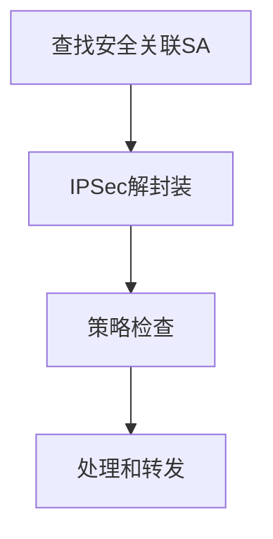

---
# 基本信息
title: 网络安全基础期末复习
date: 2024/06/30
tags: [计算机, 网络安全]
categories: [网络安全]
description: 网络安全基础期末复习
# 封面
cover: https://blog-imges-1313931661.cos.ap-nanjing.myqcloud.com/3801719809628_.pic_hd.jpg
banner: https://blog-imges-1313931661.cos.ap-nanjing.myqcloud.com/3801719809628_.pic_hd.jpg
poster:  # 海报（可选，全图封面卡片）
  topic: # 可选
  headline:  网络安全基础期末复习 # 必选
  caption:  # 可选
  color:  # 可选
# 插件
sticky: # 数字越大越靠前
mermaid: true
katex: true
mathjax: true
# 可选
topic: 计算机 # 专栏 id
author: Montee
references:
comments: # 设置 false 禁止评论
indexing: # 设置 false 避免被搜索
breadcrumb: # 设置 false 隐藏面包屑导航
leftbar: 
rightbar:
h1: # 设置为 '' 隐藏标题
type: tech # tech/story

---

> 注：
>
> 1. 本文仅供个人学习考试使用，如有错误，敬请谅解
>
> 2. 系统学习，请另寻资料

# 1. 引言

计算机安全的核心内容**（CIA三元组）**

- 机密性：
  - 数据机密性（考试成绩访问）：保证私有的或机密的信息不会被泄漏给未经授权的个体
  - 隐私性：保证个人可以控制和影响与之相关的信息，这些信息可能被手机、存储和泄漏
- 完整性：
  - 数据完整性（考试成绩修改）：保证数据只能由某种特定的、已授权的方式来更改信息和代码
  - 系统完整性（手机拍照功能被控制）：保证系统正常实现其预期功能，而不会被故意或偶然的非授权操作控制

- 可用性（数据被放在保险箱、国庆节买票）：
  - 保证系统及时运转，其服务不会拒绝已授权的用户

额外概念：

- 真实性：IP地址真实、消息签名、手机验证、活体检测
- 可计量性：安全检测

> 身份信息：隐私性
>
> 订票信息：机密性
>
> 订票不能修改：完整性
>
> 国庆节买票：可用性
>
> 实名认证：真实性
>
> 安全检测：可计量性

# 2. 对称加密和消息机密性

## Feistel 加密解密网络

左右交换、异或操作、F 函数

## 数据加密标注（DES）

基于 Feistel 结构，有 8 个S核。

## 三重DES

3DES的有效密钥长度为：56 * 3 = 168 位

3DES可以简化使用两个密钥，即k1 = k3，这样所提供的密钥长度是： 56 * 2 = 112 位

### 加密过程

### 解密过程

> 注：不要搞混加解密的密钥顺序，加密是**K1-K2-K3**，解密是**K3-K2-K1**

## AES

有10轮迭代

## 流密码和RC4

## 密码反馈（CFB）模式

CFB模式能将任意分组密码转化为流密码。

## 计数器模式

可以并行处理

# 3. 公钥密码和消息验证

## 散列函数（$H$）的要求

1. $H$可适用于任意长度的数据块
2. $H$能生成固定长度的输出
3. 对于任意给定的 $x$，计算$H(x)$相对容易，并且可以通过软/硬件方式实现
4. **单向性/抗原像攻击性：**对于给定的哈希值$h$，寻找$x$使得$H(x)＝h$在计算上不可行，即不能从h反推出$x$
5. **抗第二原像攻击性：**对给定的$x$，寻找不等于$x$的$y$，使得$H(x)＝H(y)$在计算上不可行（抗弱碰撞性），即不能找到具有相同散列值的可替换消息
6. **抗碰撞性：**寻找任意的$(x,y)$对，使得$H(x)＝H(y)$在计算上不可行（抗强碰撞性），即抗生日攻击

## SHA-512算法

输入1024比特，输出512比特

## RSA 算法(看题目要求使用哪个进行加密)

### 例题：
#### 选项 a:
- ( p = 3 ) ( q = 11 ) ( e = 7 )( M = 5 )

1. 计算 $n = pq = 3 \times 11 = 33 $。
2. 计算 $ \phi(n) = (p-1)(q-1) = 2 \times 10 = 20 $。
3. 检查 $\gcd(e, \phi(n)) = \gcd(7, 20) = 1 （满足条件）$。
4. 找到 $d $使得 $ 7d \equiv 1 \pmod{20} $。使用扩展欧几里得算法，得到 ( d = 3 )。

加密 ( M )：
$ C = M^e \mod n = 5^7 \mod 33 = 78125 \mod 33 = 14 $

解密 \( C \)：
$ M = C^d \mod n = 14^3 \mod 33 = 2744 \mod 33 = 5$

## Diffie-Hellman密钥交换

B站视频：[【不懂数学没关系】DH算法 | 迪菲-赫尔曼Diffie–Hellman 密钥交换](https://www.bilibili.com/video/BV1sY4y1p78s?vd_source=06503cc8285f468251f7ebe06f8e75de)

Diffie-Hellman密钥交换算法是一种用于在不安全信道上安全地交换加密密钥的方法。其主要目的是**让两个通信方能够生成一个共享的秘密密钥，该密钥可以用于对后续的通信进行加密，而不需要预先共享任何秘密信息**。

### 步骤
1. A和B都知道一个素数*q*和一个整数a（均公开），a是*q*的一个原根
2. 用户A选择一个随机数 $X_A<q$ ，并计算$Y_A = a^{X_A} mod q$
3. 类似地，用户B选择一个随机数 $X_A<q$ , 并计算 $Y_B = a^{X_B} mod q$
4. 每一方都对X的值保密存放；使Y的值公开，另一方可以得到
5. 用户A计算密钥：$K = (Y_B)^{X_A} mod q$；用户B计算密钥：$K = (Y_A)^{X_B} mod q$
6. 这里双方计算出的K就是共享的密钥，双方以K作为加、解密密钥，以对称密钥算法进行保密通信
7. 整个系统中，A、B双方各自的X值为各自的私钥，保密；各自的Y值为公钥，公开。

该算法的安全性在于：**虽然计算模幂运算相对容易，但是计算离散对数却非常困难。对于大素数。计算离散对数被认为是不可行的。**

### 例题

考虑公共素数$q=11$和本原根$a=2$的D-H方案。

（1）如果用户A有公钥$Y_A=9$，请问A的私钥$X_A$是什么？

（2）如果用户B有公钥$Y_B=3$，请问共享密钥$K$是什么？

（1）$Y_A=a^{X_A} mod q$，即$9=2^{X_A} mod 11$，解得$X_A=6$。

（2）$K=(Y_B)^{X_A}mod q$，即$K=3^6 mod 11$， 解得$K=3$。

## HMAC算法

HMAC（Hash-based Message Authentication Code）是一种基于哈希函数的消息认证码，用于验证消息的完整性和真实性。它结合了哈希函数和密钥，确保消息在传输过程中未被篡改。

### HMAC算法的流程

假设我们使用哈希函数 ( H )（如SHA-256）和一个密钥 ( K ) 来生成HMAC。具体步骤如下：

1. **准备密钥**：
   - 如果密钥 ( K ) 的长度大于哈希函数的块大小（如SHA-256的块大小是64字节），则先对 ( K ) 进行哈希处理：
     $
     K = H(K)
     $
   - 如果密钥 ( K ) 的长度小于哈希函数的块大小，则在其后面填充零，使其长度等于块大小。

2. **定义两个固定的填充值**：
   - 定义内填充（inner padding）$ \text{ipad} $：这是一个块大小的字节串，每个字节都是0x36。
   - 定义外填充（outer padding）$ \text{opad} $：这是一个块大小的字节串，每个字节都是0x5c。

3. **生成HMAC**：
   - 计算内部哈希：
     $
     \text{inner\_hash} = H((K \oplus \text{ipad}) \| \text{message})
     $
     其中 $ \oplus $ 表示按位异或操作，$ \| $ 表示串联操作。
   - 计算最终HMAC值：
     $
     \text{HMAC} = H((K \oplus \text{opad}) \| \text{inner\_hash})
     $

### 消息完整性保护

HMAC能够实现消息的完整性保护，原因如下：

1. **密钥的使用**：
   - **HMAC结合了一个秘密密钥 ( K ) 和哈希函数 ( H )。只有持有正确密钥的通信方才能生成正确的HMAC值。因此，攻击者无法伪造合法的HMAC值。**

2. **双重哈希**：
   - HMAC通过两次哈希操作（内部哈希和外部哈希）增加了复杂性，使得攻击者更难进行碰撞攻击或长度扩展攻击。

3. **抗碰撞性**：
   - 现代哈希函数（如SHA-256）的抗碰撞性确保了不同的消息生成不同的哈希值。即便攻击者试图篡改消息，生成的HMAC值也会不同。

4. **完整性验证**：
   - **接收方可以使用相同的密钥和HMAC算法对接收到的消息计算HMAC值，并与发送方提供的HMAC值进行比较。如果两者一致，说明消息未被篡改，否则消息可能已被修改。**

## 数字签名的产生与认证

**签名的产生**是由发送方先对消息进行计算哈希，得到一个哈希值，利用**自己的私钥**进行加密，将产生的签名和消息M结合在一起发送给接收方。

**签名的验证**是接收方将接收到的消息进行哈希计算，得到一个哈希值，利用**发送方的公钥**对签名进行解密，将解密的结果和计算出来的值进行比较是否一样，如果一样，代表消息是真实的，完整的，没有办法伪造的，如果不一样就丢弃掉。

基于Hash、基于JSC RSA的加密实现一个基本的数字签名产生与认证过程

* 产生

  * 对消息进行哈希运算，得到消息的哈希值。

  * 使用RSA的私钥对哈希值进行加密，得到签名值。

  * 签名值作为消息的数字签名。

* 验证：
  * 对接收到的消息进行哈希运算，得到消息的哈希值。
  * 使用RSA的公钥对签名值进行解密，得到解密后的哈希值。
  * 比较解密后的哈希值与消息的哈希值，如果相等则签名验证通过，否则验证失败。

### 例题

**题目描述：**

假设你是一名安全工程师，负责实现一个基于哈希和RSA加密的数字签名系统。请按照以下步骤完成数字签名的产生与验证过程。

**步骤一：签名的产生**

1. 给定一条消息 $ M $。
2. 使用 SHA-256 哈希函数对消息 ( M ) 进行哈希运算，得到哈希值 $H(M) $。
3. 使用 RSA 的私钥 $ \text{PrivateKey} $ 对哈希值 $ H(M) $ 进行加密，得到签名值 $S $。

**步骤二：签名的验证**

1. 接收到消息 $ M $ 和签名值 $ S $。
2. 使用 SHA-256 哈希函数对消息 $ M $ 进行哈希运算，得到哈希值 $ H(M) $。
3. 使用 RSA 的公钥 $ \text{PublicKey} $ 对签名值 $ S $ 进行解密，得到解密后的哈希值 $ H'(M) $。
4. 比较 $ H(M) $ 和 $ H'(M) $。如果两者相等，则签名验证通过；否则，签名验证失败。

**问题：**

1. 给定消息 $ M = "Hello, World!" $，计算其 SHA-256 哈希值。
2. 假设 RSA 私钥 $ \text{PrivateKey} $ 为 $ \text{d} = 2753 $，模数 $ \text{n} = 3233 $，计算签名值  $S $。
3. 给定 RSA 公钥 $ \text{PublicKey} $ 为 $ \text{e} = 17 $，模数 $ \text{n} = 3233 $，验证签名值 $ S $。

**提示：**

1. SHA-256 哈希值计算可以使用在线工具或编程语言库。
2. RSA 加密和解密公式为：
   - 加密：$ C = M^e \mod n $
   - 解密：$ M = C^d \mod n $
3. 提供必要的计算步骤和结果。

---

**答案示例：**

1. **消息哈希计算：**

   给定消息 $ M = "Hello, World!" $，使用 SHA-256 哈希函数计算其哈希值。

   $ H(M) = \text{SHA-256}("Hello, World!") $

   假设计算结果为（十六进制表示）：
   $ H(M) = \text{2ef7bde608ce5404e97d5f042f95f89f1c232871} $

2. **签名值计算：**

   使用 RSA 私钥 $ \text{d} = 2753 $，模数 $ \text{n} = 3233 $，对哈希值 $ H(M) $ 进行加密。

   假设 $ H(M) $ 的十进制表示为 $ m $，则签名值 $ S $ 计算如下：

   $ S = m^{2753} \mod 3233 $

   计算结果为（假设计算结果为某个数值）：
   $ S = 1234 $

3. **签名验证：**

   使用 RSA 公钥 $ \text{e} = 17 $，模数 $ \text{n} = 3233 $，对签名值 $ S $ 进行解密。

   $ H'(M) = S^{17} \mod 3233 $

   计算结果为（假设计算结果为与 $ H(M) $ 相等的值）：
   $ H'(M) = \text{2ef7bde608ce5404e97d5f042f95f89f1c232871} $

   比较 $ H(M) $ 和 $ H'(M) $，两者相等，签名验证通过。

# 4. 密钥分配和用户验证

## Kerberos 协议

在Kerberos协议中，身份验证是通过票据（Ticket）和验证器（Authenticator）来实现的。以下是每一步中客户端（C）和服务器（V）的身份验证过程：

### (a) 用于获取票据授予票据的认证服务交换

1. **C → AS**:
   - 客户端 $ C $ 向认证服务器 $ AS $ 请求票据授予票据。
   - 消息内容：$ ID_C \| ID_{tgs} \| TS_1 $
   - **身份验证**：
     - 认证服务器 $ AS $ 使用客户端 $ C $ 的标识 $ ID_C $ 来查找其密钥 $ K_C $。

2. **AS → C**:
   - 认证服务器 $ AS $ 返回票据授予票据和会话密钥。
   - 消息内容：$ E(K_C, [K_{C,tgs} \| ID_{tgs} \| TS_2 \| Lifetime_2 \| Ticket_{tgs}]) $
   - **身份验证**：
     - 客户端 $ C $ 使用其密钥 $ K_C $ 解密消息，验证消息的完整性和真实性。
     - 客户端 $ C $ 通过验证时间戳 $ TS_2 $ 确保消息的时效性。

### (b) 用于获得服务授权票据的票据授予服务交换

3. **C → TGS**:
   - 客户端 $ C $ 向票据授予服务器 $ TGS $ 请求服务授权票据。
   - 消息内容：$ ID_V \| Ticket_{tgs} \| Authenticator_C $
   - **身份验证**：
     - 票据授予服务器 $ TGS $ 使用其密钥 $ K_{tgs} $ 解密 $ Ticket_{tgs} $，得到会话密钥 $ K_{C,tgs} $。
     - 票据授予服务器 $ TGS $ 使用会话密钥 $ K_{C,tgs} $ 解密 $ Authenticator_C $，验证客户端 $ C $ 的身份和时间戳 $ TS_3 $ 的时效性。

4. **TGS → C**:
   - 票据授予服务器 $ TGS $ 返回服务授权票据和会话密钥。
   - 消息内容：$ E(K_{C,tgs}, [K_{C,V} \| ID_V \| TS_4 \| Lifetime_4 \| Ticket_V]) $
   - **身份验证**：
     - 客户端 $ C $ 使用会话密钥 $ K_{C,tgs} $ 解密消息，验证消息的完整性和真实性。
     - 客户端 $ C $ 通过验证时间戳 $ TS_4 $ 确保消息的时效性。

### (c) 为获得服务而进行的客户端/服务器认证交换

5. **C → V**:
   - 客户端 $ C $ 向目标服务器 $ V $ 请求服务。
   - 消息内容：$ Ticket_V \| Authenticator_C $
   - **身份验证**：
     - 目标服务器 $ V $ 使用其密钥 $ K_V $ 解密 $ Ticket_V $，得到会话密钥 $ K_{C,V} $。
     - 目标服务器 $ V $ 使用会话密钥 $ K_{C,V} $ 解密 $ Authenticator_C $，验证客户端 $ C $ 的身份和时间戳 $ TS_5 $ 的时效性。

6. **V → C**:
   - 目标服务器 $ V $ 响应客户端 $ C $ 的请求。
   - 消息内容：$ E(K_{C,V}, [TS_5 + 1]) $
   - **身份验证**：
     - 客户端 $ C $ 使用会话密钥 $ K_{C,V} $ 解密消息，验证消息的完整性和真实性。
     - 客户端 $ C $ 通过验证时间戳 $ TS_5 + 1 $ 确保服务器 $ V $ 的响应是针对当前会话的，从而实现双向认证。

## 证书

签名是将红色框框内的所有信息合在一起做哈希，再利用权威机构的私钥进行数字签名。**签名的核心功能是为了保证公钥的安全发布**

X.509 方案的核心是**与每个用户相关联的公钥证书**。这些用户证书是由可信任的认证中心创建，并由CA或用户放在目录中。目录服务器本身不负责公钥的产生和认知功能；它只为用户获取证书提供一个容易访问的场所。

证书通过以下方式实现公钥的安全发布：

- **身份验证**：CA验证用户的身份，确保公钥和身份信息的真实性。
- **数字签名**：CA使用其私钥对证书进行签名，确保证书的完整性和来源的可信性。
- **公开发布**：证书通过公开目录、安全通道或嵌入应用程序等方式发布，使其广泛可用。
- **验证机制**：接收方通过验证签名、检查有效期和吊销状态等方式，确保证书的有效性和可信性。

# 6. 传输层安全

## 握手协议

> 第一阶段和第四阶段都有，二三阶段根据题目要求具体分析

### 第二阶段：服务器认知和密钥交换

* **服务器发送自己的证书**，消息包含一个X.509证书，或者一条证书链
* ==服务器发送server_key_exchange消息（可选，视情况定）==
  * 不发送
    * 服务器已发送包含固定Diffie-Hellman 参数的证书
    * 使用了RSA密钥交换算法
  * 发送（当服务器的证书没有包含必需的数据）
    * 匿名DH：消息由两个全局DH密钥值及一个服务器公钥
    * 暂态DH：消息内容由三个DH参数和一个对参数的签名组成
    * RSA密钥交换发生在服务器使用了RSA但是有一个仅用于RSA签名的密钥的情况下
* ==服务器发送certificate_request消息==（什么情况下发送？）
  * **非匿名server可以向客户请求一个证书**
  * 包含证书类型CT和证书机构CAs
* **服务器发送server_done, 然后等待应答**

### 第三阶段：客户端认知和密钥交换

* 客户收到server_done消息后，根据需要检查服务器提供的证书，并判断server_hello的参数是否可以接受，如果都没有问题的话，发送一个或多个消息给服务器
* **如果服务器请求证书的话，则客户首先发送一个certificate消息，若客户没有证书，则发送一个no_certificate警告**
* 客户**发送client_key_exchange**消息
* 最后，客户**发送一个certificate_verify**消息，其中包含一个签名，对从第一条消息以来的所有握手消息的MAC值进行签名

# 9. IP安全

## IP 通信进程

IPSec（Internet Protocol Security）是一套用于确保在IP网络上进行安全通信的协议。它提供了数据验证、数据完整性和数据加密功能。IPSec的处理模型可以分为出站（发送数据）和入站（接收数据）两部分。下面简述这两个处理模型的流程。

### 出站报文处理模型

### 入站报文处理模型

1. **安全关联（SA）查找**：
   - 当一个IPSec报文到达时，根据报文中的SA标识符（如SPI，Security Parameters Index）在SAD中查找相应的SA。

2. **IPSec解封装**：
   - 根据找到的SA，对报文进行解封装处理。
   - 如果报文使用ESP，则进行解密和/或认证检查。
   - 如果报文使用AH，则进行认证检查。

3. **策略检查（Policy Check）**：
   - 解封装后，报文会根据SPD进行策略检查，确保其符合安全策略。

4. **处理和转发**：
   - 经过验证的报文将被传递给上层协议或应用程序进行进一步处理。

# 10. 恶意软件

| 名称           |                             描述                             |
| -------------- | :----------------------------------------------------------: |
| 病毒           | 当执行时，向可执行代码传播自身副本的恶意代码;传播成功时，可执行程序被感染。当被感染代码执行时，病毒也执行 |
| 蠕虫           | 可独立执行的计算机程序，并可以向网络中的其他主机传播自身副本 |
| 逻辑炸弹       | 入侵者植入软件的程序，逻辑炸弹潜藏到触发条件满足为止，然后该程序激发一个未授权的动作 |
| 特洛伊木马     | 貌似有用的计算机程序，但也包含能够规避安全机制的藏恶意功能，有时利用系统的合法授权引发特洛伊木马程序 |
| 后门/陷门      |      能够绕过安全检查的任意机制:允许对未授权的功能访问       |
| 可移动代码     | 能够不变的植入各种不同平台，执行时有身份语义的软件(例如，脚本、宏或者其他可移动指令) |
| 漏洞利用       |               针对某一个漏洞或者一组漏洞的代码               |
| 下载者         | 可以在遭受攻击的机器上安装其他条款的程序。通常，下载者是通过电子邮件传播的 |
| 自动路由程序   |         用于远程入侵到未被感染的机器中的恶意攻击工具         |
| 病毒生成工具包 |                 一组用于自动生成新病毒的工具                 |
| 垃圾邮件程序   |                 用于发送大量不必要的电子邮件                 |
| 洪流           | 用于占用大量网络资源对网络计算机系统进行攻击从而实现DoS攻击  |
| 键盘日志       |                  捕获被感染系统中的用户按键                  |
| Rootkit        |   当攻击者进入计算机系统并获得低层通路之后，使用的攻击工具   |
| 僵尸           |         跃在被感染的机器上并向其他机器发射攻击的程序         |
| 间谍软件       |         从一个计算机上收集信息并发送到其他系统的软件         |
| 广告软件       |      整合到软件中的广告。结果是弹出广告或者指向购物网站      |

## DDos 防护措施

### 预防为主的应付方法

1. 定期扫描：要定期扫描现有的网络主节点，清查可能存在的安全漏洞，对新出现的漏洞及时进行清理。
2. 在骨干节点配置防火墙：防火墙本身能抵御DdoS攻击和其他一些攻击。在发现受到攻击的时候，可以将攻击导向一些牺牲主机，这样可以保护真正的主机不被攻击。
3. 用足够的机器承受黑客攻击：这是一种较为理想的应对策略
4. 充分利用网络设备保护网络资源：所谓网络设备是指路由器、防火墙等负载均衡设备，它们可将网络有效地保护起来
5. 过滤不必要的服务和端口：过滤不必要的服务和端口，即在路由器上过滤假IP，只开放服务端口成为目前很多服务器的流行做法。
6. 限制SYN/ICMP流量：
7. 用户应在路由器上配置SYN/ICMP的最大流量来限制SYN/ICMP封包所能占有的最高频宽，这样，当出现大量的超过所限定的SYN/ICMP流量时，说明不是正常的网络访问，而是有黑客攻击。
8. 检查访问者的来源：使用单播反向路径转发(Unicast Reverse Path Forwarding)等通过反向路由器查询的方法检查访问者的IP地址是否是真，如果是假的，它将予以屏蔽。

# 11. 入侵者

## 入侵检测工具

| **工具**   | **作用**     |
| ---------- | ------------ |
| Nmap       | 端口扫描     |
| Nessus     | 漏洞扫描     |
| Metasploit | 漏洞入侵利用 |
| Snort      | 入侵检测     |

## 入侵步骤

首先对目标信息进行研判和分析，寻找可能存在漏洞的服务，判断系统后选择最简方式入侵，获取系统一定权限后提升为最高权限，安装多个系统后门，清除入侵脚印，最后可以获取敏感信息、攻击其他系统或作为其他用途。

## 蜜罐

设计目的：

1. 转移关于攻击者活动的访问
2. 收集关于攻击者活动的信息
3. 鼓励攻击者停留在系统中足够长时间以便管理员作出反应

# 综合题

## 场景描述一

公司A是一家大型科技公司，拥有多个部门和分支机构，员工数量众多，业务系统复杂。最近，公司A的IT部门发现网络中存在异常流量，部分员工报告他们的计算机出现了异常行为，如系统变慢、文件丢失等。经过初步调查，发现公司网络中可能存在恶意软件感染。为了应对这一安全威胁，公司决定采取一系列安全措施，包括密码学、异常检测、杀毒软件、入侵检测和防火墙。

### 考题

**问题1：** 请描述公司A应该如何利用密码学技术来保护其敏感数据，并举例说明具体的应用场景。

**问题2：** 公司A如何设计和实施异常检测系统来监控和识别网络中的异常行为？请详细描述异常检测系统的工作原理和关键组件。

**问题3：** 请解释杀毒软件在公司A网络安全中的作用，并描述如何选择和配置合适的杀毒软件以应对当前的安全威胁。

**问题4：** 设计一个入侵检测系统（IDS）方案，详细描述其工作流程和如何与其他安全措施（如防火墙）协同工作。

**问题5：** 公司A的防火墙策略应如何制定，以有效防止恶意流量进入网络？请详细描述防火墙的配置和规则设置。

### 答案

**答案1：**
公司A可以使用以下密码学技术来保护其敏感数据：
- **数据加密**：使用AES对称加密算法对静态数据进行加密，确保数据在存储时的机密性。举例：对数据库中的客户信息进行加密存储。
- **传输加密**：使用TLS协议对网络传输中的数据进行加密，保护数据在传输过程中的机密性和完整性。举例：在员工访问公司内部系统时，使用HTTPS确保数据传输安全。
- **数字签名**：使用RSA算法生成数字签名，验证重要文件和通信的来源真实性和完整性。举例：对公司内部重要文件进行数字签名，防止篡改。
- **哈希函数**：使用SHA-256生成文件的哈希值，用于数据完整性校验。举例：在数据备份和恢复过程中，使用哈希值验证数据完整性。

**答案2：**
公司A可以设计和实施以下异常检测系统：
- **行为基线**：建立正常网络和系统行为的基线，通过机器学习和统计分析方法，识别异常行为。
- **实时监控**：部署网络流量监控工具，实时监控网络数据包，识别异常流量和潜在威胁。
- **告警机制**：设置告警规则，一旦检测到异常行为，立即触发告警，通知安全团队。
- **日志分析**：定期收集和分析系统和网络日志，识别潜在的安全事件和趋势。
- **关键组件**：包括网络流量分析器、行为分析引擎、告警管理系统和日志管理系统。

**答案3：**
杀毒软件在公司A网络安全中的作用包括：
- **实时保护**：监控文件和系统活动，阻止恶意软件的运行。
- **病毒扫描**：定期扫描系统，检测和清除已知和未知的恶意软件。
- **行为分析**：通过分析软件行为特征，识别未知恶意软件。
- **选择和配置**：选择具有良好口碑和高检测率的杀毒软件，定期更新病毒库；配置实时保护和定期扫描功能，确保覆盖所有工作站和服务器。

**答案4：**
入侵检测系统（IDS）方案设计：
- **签名检测**：使用预定义的攻击签名库检测已知攻击模式。
- **异常检测**：结合异常检测技术，识别未知攻击和异常行为。
- **网络监控**：监控网络流量，检测网络层和应用层的攻击活动。
- **主机监控**：监控主机系统活动，检测系统层面的入侵行为。
- **响应机制**：一旦检测到入侵行为，立即触发响应机制，如阻断连接、隔离受感染系统等。
- **协同工作**：IDS与防火墙协同工作，防火墙根据IDS的检测结果动态调整规则，阻止恶意流量进入网络。

**答案5：**
公司A的防火墙策略应包括：
- **包过滤防火墙**：基于IP地址、端口和协议的规则过滤网络流量，阻止未经授权的访问。
- **状态检测防火墙**：跟踪和检查网络连接的状态，确保只允许合法的流量通过。
- **应用层防火墙**：深入检查应用层数据，防止应用层攻击（如SQL注入、XSS）。
- **规则设置**：根据公司网络架构和业务需求，制定详细的防火墙规则，如允许内部网络访问互联网，限制外部网络访问内部系统等。
- **动态调整**：结合IDS的检测结果，动态调整防火墙规则，及时阻止新的威胁。

通过以上设计和实施，能够有效提高公司A的网络安全水平，防御各种恶意代码和网络攻击。

## 场景描述二

公司B是一家金融服务公司，处理大量敏感的客户信息和金融交易数据。最近，公司B的安全团队发现了一次未遂的入侵尝试，攻击者试图通过SQL注入攻击获取客户数据库中的信息。为了增强系统的安全性，公司B决定实施一系列安全措施，包括使用密码学技术保护数据、部署异常检测系统、安装和配置杀毒软件、设置入侵检测系统（IDS）以及完善防火墙策略。

### 考题

**问题：** 结合公司B的业务需求和安全威胁，设计一个综合的安全防护方案，具体包括以下方面：

1. 如何使用密码学技术保护客户信息和金融交易数据？
2. 如何设计和实施异常检测系统来监控和识别SQL注入攻击及其他异常行为？
3. 杀毒软件在保护公司B的系统和数据安全中应该如何配置和使用？
4. 设计一个入侵检测系统（IDS）方案，详细描述其工作流程和如何与其他安全措施（如防火墙）协同工作，特别是防御SQL注入攻击。
5. 公司B的防火墙策略应如何制定，以有效防止SQL注入攻击和其他网络威胁？

### 答案

**答案1：**
公司B可以使用以下密码学技术来保护客户信息和金融交易数据：
- **数据加密**：使用AES对称加密算法对客户信息和交易数据进行加密，确保数据在存储时的机密性。举例：对数据库中的客户信息和交易记录进行加密存储。
- **传输加密**：使用TLS协议对网络传输中的数据进行加密，保护数据在传输过程中的机密性和完整性。举例：在客户访问网上银行系统时，使用HTTPS确保数据传输安全。
- **数字签名**：使用RSA算法生成数字签名，验证金融交易的来源真实性和完整性。举例：对每笔金融交易生成数字签名，确保交易的合法性和防止篡改。
- **哈希函数**：使用SHA-256生成交易数据的哈希值，用于数据完整性校验。举例：在数据备份和恢复过程中，使用哈希值验证数据完整性。

**答案2：**
公司B可以设计和实施以下异常检测系统来监控和识别SQL注入攻击及其他异常行为：
- **行为基线**：建立正常数据库查询和系统行为的基线，通过机器学习和统计分析方法，识别异常查询和行为。
- **实时监控**：部署数据库活动监控工具，实时监控SQL查询，识别异常查询模式和潜在的SQL注入攻击。
- **告警机制**：设置告警规则，一旦检测到异常SQL查询，立即触发告警，通知安全团队。
- **日志分析**：定期收集和分析数据库日志和系统日志，识别潜在的安全事件和趋势。
- **关键组件**：包括数据库活动监控器、行为分析引擎、告警管理系统和日志管理系统。

**答案3：**
杀毒软件在保护公司B的系统和数据安全中应该配置和使用如下：
- **实时保护**：启用实时保护功能，监控文件和系统活动，阻止恶意软件的运行。
- **病毒扫描**：定期扫描系统，检测和清除已知和未知的恶意软件。
- **行为分析**：通过分析软件行为特征，识别未知恶意软件，特别是针对金融系统的定向攻击。
- **选择和配置**：选择具有良好口碑和高检测率的杀毒软件，定期更新病毒库；配置实时保护和定期扫描功能，确保覆盖所有工作站、服务器和数据库系统。

**答案4：**
入侵检测系统（IDS）方案设计：
- **签名检测**：使用预定义的攻击签名库检测已知攻击模式，包括SQL注入攻击。
- **异常检测**：结合异常检测技术，识别未知攻击和异常行为，特别是异常的SQL查询模式。
- **网络监控**：监控网络流量，检测网络层和应用层的攻击活动。
- **主机监控**：监控主机系统活动，检测系统层面的入侵行为。
- **响应机制**：一旦检测到入侵行为，立即触发响应机制，如阻断连接、隔离受感染系统等。
- **协同工作**：IDS与防火墙协同工作，防火墙根据IDS的检测结果动态调整规则，阻止恶意流量进入网络，特别是阻止SQL注入攻击。

**答案5：**
公司B的防火墙策略应包括：
- **包过滤防火墙**：基于IP地址、端口和协议的规则过滤网络流量，阻止未经授权的访问。
- **状态检测防火墙**：跟踪和检查网络连接的状态，确保只允许合法的流量通过。
- **应用层防火墙**：深入检查应用层数据，防止应用层攻击（如SQL注入、XSS）。
- **规则设置**：根据公司网络架构和业务需求，制定详细的防火墙规则，如允许内部网络访问互联网，限制外部网络访问内部系统等。
- **动态调整**：结合IDS的检测结果，动态调整防火墙规则，及时阻止新的威胁，特别是针对SQL注入攻击的特定规则，如过滤特定的SQL关键字和模式。

通过以上设计和实施，能够有效提高公司B的网络安全水平，防御各种安全威胁，特别是SQL注入攻击，保障客户信息和金融交易数据的安全。

## 场景描述三

公司C是一家在线零售商，依赖其电子商务平台进行日常业务运营。最近，公司C遭遇了一次大规模的DDoS（分布式拒绝服务）攻击，导致其网站瘫痪，客户无法访问，销售额大幅下降。为了防止类似事件再次发生，公司C决定采取一系列安全措施，包括流量监控、流量清洗、负载均衡、入侵检测和防火墙等技术手段。

### 考题

**问题：** 结合公司C的业务需求和面临的DDoS威胁，设计一个综合的防护方案，具体包括以下方面：

1. 如何利用流量监控和流量清洗技术来防御DDoS攻击？
2. 负载均衡在防御DDoS攻击中的作用是什么？请详细描述其实现方式。
3. 设计一个入侵检测系统（IDS）方案，详细描述其工作流程和如何与其他安全措施（如防火墙、流量清洗）协同工作，特别是防御DDoS攻击。
4. 公司C的防火墙策略应如何制定，以有效防止DDoS攻击和其他网络威胁？
5. 除了技术手段，公司C还可以采取哪些非技术措施来增强其抵御DDoS攻击的能力？

### 答案

**答案1：**
公司C可以利用以下流量监控和流量清洗技术来防御DDoS攻击：
- **流量监控**：部署流量监控工具（如NetFlow、sFlow），实时监控网络流量，识别异常流量模式和潜在的DDoS攻击。
- **流量清洗**：使用流量清洗服务（如云清洗服务）来过滤恶意流量。流量清洗服务会将正常流量与恶意流量分离，只将正常流量转发到公司C的服务器。
- **流量分析**：通过分析流量数据，识别DDoS攻击的特征（如流量峰值、异常源IP地址等），并制定相应的防御策略。

**答案2：**
负载均衡在防御DDoS攻击中的作用包括：
- **分散流量**：通过负载均衡器将流量分散到多个服务器，防止单个服务器因流量过大而崩溃。
- **流量调度**：根据服务器的负载情况，动态调整流量分配，确保系统的稳定性和可用性。
- **冗余设计**：通过多台负载均衡器的冗余设计，确保在一台负载均衡器受攻击时，系统仍能正常运行。
- **实现方式**：可以使用硬件负载均衡器（如F5、Citrix）或软件负载均衡器（如HAProxy、Nginx），并结合DNS负载均衡（如Cloudflare、AWS Route 53）实现全局流量分配。

**答案3：**
入侵检测系统（IDS）方案设计：
- **签名检测**：使用预定义的攻击签名库检测已知的DDoS攻击模式，如SYN flood、UDP flood等。
- **异常检测**：结合异常检测技术，识别未知的DDoS攻击和异常流量行为。
- **网络监控**：监控网络流量，检测网络层和应用层的攻击活动，特别是异常的流量峰值和来源。
- **响应机制**：一旦检测到DDoS攻击，立即触发响应机制，如通知流量清洗服务、调整负载均衡策略、更新防火墙规则等。
- **协同工作**：IDS与防火墙、流量清洗服务协同工作，防火墙根据IDS的检测结果动态调整规则，阻止恶意流量进入网络；流量清洗服务根据IDS的告警信息，及时清洗恶意流量。

**答案4：**
公司C的防火墙策略应包括：
- **包过滤防火墙**：基于IP地址、端口和协议的规则过滤网络流量，阻止未经授权的访问。
- **状态检测防火墙**：跟踪和检查网络连接的状态，确保只允许合法的流量通过。
- **应用层防火墙**：深入检查应用层数据，防止应用层攻击（如HTTP flood）。
- **DDoS防护规则**：设置针对DDoS攻击的特定规则，如限制单个IP地址的连接数、速率限制、黑名单和白名单等。
- **动态调整**：结合IDS的检测结果，动态调整防火墙规则，及时阻止新的威胁。

**答案5：**
除了技术手段，公司C还可以采取以下非技术措施来增强其抵御DDoS攻击的能力：
- **应急预案**：制定详细的DDoS攻击应急预案，包括攻击响应流程、责任分工和沟通机制。
- **员工培训**：定期培训员工，提高他们对DDoS攻击的认识和应对能力。
- **合作伙伴**：与DDoS防护服务提供商建立合作关系，利用其专业的防护能力应对大规模攻击。
- **客户沟通**：在遭遇DDoS攻击时，及时通知客户，解释情况并提供解决方案，维护客户信任。
- **业务连续性**：制定业务连续性计划，确保在遭遇DDoS攻击时，关键业务能够继续运行。

通过以上设计和实施，能够有效提高公司C的网络安全水平，防御各种DDoS攻击，保障电子商务平台的稳定性和可用性。
