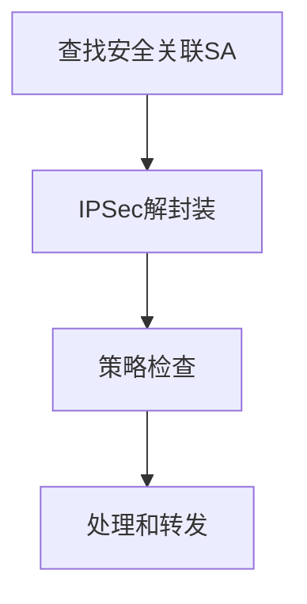

---
# 基本信息
title: 网络安全基础期末复习
date: 2024/06/30
tags: [计算机, 网络安全]
categories: [网络安全]
description: 网络安全基础期末复习
# 封面
cover: https://blog-imges-1313931661.cos.ap-nanjing.myqcloud.com/20200317211518_nNfZE.gif
banner:https://blog-imges-1313931661.cos.ap-nanjing.myqcloud.com/20200317211518_nNfZE.gif
poster:  # 海报（可选，全图封面卡片）
  topic: # 可选
  headline:  网络安全基础期末复习 # 必选
  caption:  # 可选
  color:  # 可选
# 插件
sticky: # 数字越大越靠前
mermaid:
katex: true
mathjax: 
# 可选
topic: 计算机 # 专栏 id
author: Montee
references:
comments: # 设置 false 禁止评论
indexing: # 设置 false 避免被搜索
breadcrumb: # 设置 false 隐藏面包屑导航
leftbar: 
rightbar:
h1: # 设置为 '' 隐藏标题
type: tech # tech/story

---

> 注：
>
> 1. 本文仅供个人学习考试使用，如有错误，敬请谅解
>
> 2. 系统学习，请另寻资料

# 1. 引言

计算机安全的核心内容**（CIA三元组）**

- 机密性：
  - 数据机密性（考试成绩访问）：保证私有的或机密的信息不会被泄漏给未经授权的个体
  - 隐私性：保证个人可以控制和影响与之相关的信息，这些信息可能被手机、存储和泄漏
- 完整性：
  - 数据完整性（考试成绩修改）：保证数据只能由某种特定的、已授权的方式来更改信息和代码
  - 系统完整性（手机拍照功能被控制）：保证系统正常实现其预期功能，而不会被故意或偶然的非授权操作控制

- 可用性（数据被放在保险箱、国庆节买票）：
  - 保证系统及时运转，其服务不会拒绝已授权的用户

额外概念：

- 真实性：IP地址真实、消息签名、手机验证、活体检测
- 可计量性：安全检测

> 身份信息：隐私性
>
> 订票信息：机密性
>
> 订票不能修改：完整性
>
> 国庆节买票：可用性
>
> 实名认证：真实性
>
> 安全检测：可计量性

# 2. 对称加密和消息机密性

## 数据加密标注（DES）
基于 Feistel 结构，有 8 个S核。

## 三重DES

3DES的有效密钥长度为：56 * 3 = 168 位

3DES可以简化使用两个密钥，即k1 = k3，这样所提供的密钥长度是： 56 * 2 = 112 位

### 加密过程

### 解密过程

## AES

有10轮迭代

## 流密码和RC4

## 密码反馈（CFB）模式

CFB模式能将任意分组密码转化为流密码。

## 计数器模式

可以并行执行

# 3. 公钥密码和消息验证

## 散列函数（$H$）的要求

1. $H$可适用于任意长度的数据块
2. $H$能生成固定长度的输出
3. 对于任意给定的 $x$，计算$H(x)$相对容易，并且可以通过软/硬件方式实现
4. **单向性/抗原像攻击性：**对于给定的哈希值$h$，寻找$x$使得$H(x)＝h$在计算上不可行，即不能从h反推出$x$
5. **抗第二原像攻击性：**对给定的$x$，寻找不等于$x$的$y$，使得$H(x)＝H(y)$在计算上不可行（抗弱碰撞性），即不能找到具有相同散列值的可替换消息
6. **抗碰撞性：**寻找任意的$(x,y)$对，使得$H(x)＝H(y)$在计算上不可行（抗强碰撞性），即抗生日攻击

## RSA 算法

### 例题：
#### 选项 a:
- \( p = 3 \) ( q = 11 \) \( e = 7 \)\( M = 5 \)

1. 计算 $n = pq = 3 \times 11 = 33 $。
2. 计算 $ \phi(n) = (p-1)(q-1) = 2 \times 10 = 20 $。
3. 检查 $\gcd(e, \phi(n)) = \gcd(7, 20) = 1 （满足条件）$。
4. 找到 $d $使得 $ 7d \equiv 1 \pmod{20} $。使用扩展欧几里得算法，得到 \( d = 3 \)。

加密 \( M \)：
$ C = M^e \mod n = 5^7 \mod 33 = 78125 \mod 33 = 14 $

解密 \( C \)：
$ M = C^d \mod n = 14^3 \mod 33 = 2744 \mod 33 = 5$

## Diffie-Hellman密钥交换

B站视频：[【不懂数学没关系】DH算法 | 迪菲-赫尔曼Diffie–Hellman 密钥交换](https://www.bilibili.com/video/BV1sY4y1p78s?vd_source=06503cc8285f468251f7ebe06f8e75de)

Diffie-Hellman密钥交换算法是一种用于在不安全信道上安全地交换加密密钥的方法。其主要目的是**让两个通信方能够生成一个共享的秘密密钥，该密钥可以用于对后续的通信进行加密，而不需要预先共享任何秘密信息**。

### 步骤
1. A和B都知道一个素数*q*和一个整数a（均公开），a是*q*的一个原根
2. 用户A选择一个随机数 $X_A<q$ ，并计算$Y_A = a^{X_A} mod q$
3. 类似地，用户B选择一个随机数 $X_A<q$ , 并计算 $Y_B = a^{X_B} mod q$
4. 每一方都对X的值保密存放；使Y的值公开，另一方可以得到
5. 用户A计算密钥：$K = (Y_B)^{X_A} mod q$；用户B计算密钥：$K = (Y_A)^{X_B} mod q$
6. 这里双方计算出的K就是共享的密钥，双方以K作为加、解密密钥，以对称密钥算法进行保密通信
7. 整个系统中，A、B双方各自的X值为各自的私钥，保密；各自的Y值为公钥，公开。

该算法的安全性在于：**虽然计算模幂运算相对容易，但是计算离散对数却非常困难。对于大素数。计算离散对数被认为是不可行的。**

## HMAC算法

HMAC（Hash-based Message Authentication Code）是一种基于哈希函数的消息认证码，用于验证消息的完整性和真实性。它结合了哈希函数和密钥，确保消息在传输过程中未被篡改。

### HMAC算法的流程

假设我们使用哈希函数 \( H \)（如SHA-256）和一个密钥 \( K \) 来生成HMAC。具体步骤如下：

1. **准备密钥**：
   - 如果密钥 \( K \) 的长度大于哈希函数的块大小（如SHA-256的块大小是64字节），则先对 \( K \) 进行哈希处理：
     $
     K = H(K)
     $
   - 如果密钥 \( K \) 的长度小于哈希函数的块大小，则在其后面填充零，使其长度等于块大小。

2. **定义两个固定的填充值**：
   - 定义内填充（inner padding）$ \text{ipad} $：这是一个块大小的字节串，每个字节都是0x36。
   - 定义外填充（outer padding）$ \text{opad} 4：这是一个块大小的字节串，每个字节都是0x5c。

3. **生成HMAC**：
   - 计算内部哈希：
     $
     \text{inner\_hash} = H((K \oplus \text{ipad}) \| \text{message})
     $
     其中 $ \oplus $ 表示按位异或操作，$ \| $ 表示串联操作。
   - 计算最终HMAC值：
     $
     \text{HMAC} = H((K \oplus \text{opad}) \| \text{inner\_hash})
     $

### 消息完整性保护

HMAC能够实现消息的完整性保护，原因如下：

1. **密钥的使用**：
   - **HMAC结合了一个秘密密钥 \( K \) 和哈希函数 \( H \)。只有持有正确密钥的通信方才能生成正确的HMAC值。因此，攻击者无法伪造合法的HMAC值。**

2. **双重哈希**：
   - HMAC通过两次哈希操作（内部哈希和外部哈希）增加了复杂性，使得攻击者更难进行碰撞攻击或长度扩展攻击。

3. **抗碰撞性**：
   - 现代哈希函数（如SHA-256）的抗碰撞性确保了不同的消息生成不同的哈希值。即便攻击者试图篡改消息，生成的HMAC值也会不同。

4. **完整性验证**：
   - **接收方可以使用相同的密钥和HMAC算法对接收到的消息计算HMAC值，并与发送方提供的HMAC值进行比较。如果两者一致，说明消息未被篡改，否则消息可能已被修改。**

## 数字签名的产生与认证（？）

# 4. 密钥分配和用户验证

X.509 方案的核心是与每个用户相关联的公钥证书。这些用户证书是由可信任的认证中心创建，并由CA或用户放在目录中。目录服务器本身不负责公钥的产生和认知功能；它只为用户获取证书提供一个容易访问的场所。

# 6. 传输层安全

## 握手协议

> 第一阶段和第四阶段都有，二三阶段根据题目要求具体分析

### 第二阶段：服务器认知和密钥交换

* **服务器发送自己的证书**，消息包含一个X.509证书，或者一条证书链
* ==服务器发送server_key_exchange消息（可选，视情况定）==
  * 不发送
    * 服务器已发送包含固定Diffie-Hellman 参数的证书
    * 使用了RSA密钥交换算法
  * 发送（当服务器的证书没有包含必需的数据）
    * 匿名DH：消息由两个全局DH密钥值及一个服务器公钥
    * 暂态DH：消息内容由三个DH参数和一个对参数的签名组成
    * RSA密钥交换发生在服务器使用了RSA但是有一个仅用于RSA签名的密钥的情况下
* ==服务器发送certificate_request消息==（什么情况下发送？）
  * **非匿名server可以向客户请求一个证书**
  * 包含证书类型CT和证书机构CAs
* **服务器发送server_done, 然后等待应答**

### 第三阶段：客户端认知和密钥交换

* 客户收到server_done消息后，根据需要检查服务器提供的证书，并判断server_hello的参数是否可以接受，如果都没有问题的话，发送一个或多个消息给服务器
* **如果服务器请求证书的话，则客户首先发送一个certificate消息，若客户没有证书，则发送一个no_certificate警告**
* 客户**发送client_key_exchange**消息
* 最后，客户**发送一个certificate_verify**消息，其中包含一个签名，对从第一条消息以来的所有握手消息的MAC值进行签名

# 9. IP安全

## IP 通信进程

IPSec（Internet Protocol Security）是一套用于确保在IP网络上进行安全通信的协议。它提供了数据验证、数据完整性和数据加密功能。IPSec的处理模型可以分为出站（发送数据）和入站（接收数据）两部分。下面简述这两个处理模型的流程。

### 出站报文处理模型

### 入站报文处理模型

1. **安全关联（SA）查找**：
   - 当一个IPSec报文到达时，根据报文中的SA标识符（如SPI，Security Parameters Index）在SAD中查找相应的SA。

2. **IPSec解封装**：
   - 根据找到的SA，对报文进行解封装处理。
   - 如果报文使用ESP，则进行解密和/或认证检查。
   - 如果报文使用AH，则进行认证检查。

3. **策略检查（Policy Check）**：
   - 解封装后，报文会根据SPD进行策略检查，确保其符合安全策略。

4. **处理和转发**：
   - 经过验证的报文将被传递给上层协议或应用程序进行进一步处理。

# 10. 恶意软件

1. 了解恶意软件分类

## DDos 防护措施

### 预防为主的应付方法

1. 定期扫描：要定期扫描现有的网络主节点，清查可能存在的安全漏洞，对新出现的漏洞及时进行清理。
2. 在骨干节点配置防火墙：防火墙本身能抵御DdoS攻击和其他一些攻击。在发现受到攻击的时候，可以将攻击导向一些牺牲主机，这样可以保护真正的主机不被攻击。
3. 用足够的机器承受黑客攻击：这是一种较为理想的应对策略
4. 充分利用网络设备保护网络资源：所谓网络设备是指路由器、防火墙等负载均衡设备，它们可将网络有效地保护起来
5. 过滤不必要的服务和端口：过滤不必要的服务和端口，即在路由器上过滤假IP，只开放服务端口成为目前很多服务器的流行做法。
6. 限制SYN/ICMP流量：
7. 用户应在路由器上配置SYN/ICMP的最大流量来限制SYN/ICMP封包所能占有的最高频宽，这样，当出现大量的超过所限定的SYN/ICMP流量时，说明不是正常的网络访问，而是有黑客攻击。
8. 检查访问者的来源：使用单播反向路径转发(Unicast Reverse Path Forwarding)等通过反向路由器查询的方法检查访问者的IP地址是否是真，如果是假的，它将予以屏蔽。

# 11. 入侵者

## 蜜罐

设计目的：

1. 转移关于攻击者活动的访问
2. 收集关于攻击者活动的信息
3. 鼓励攻击者停留在系统中足够长时间以便管理员作出反应

